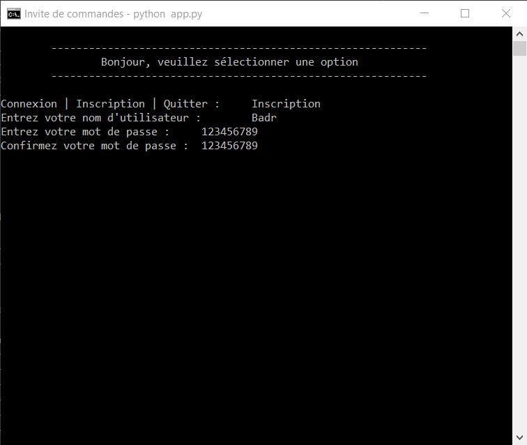
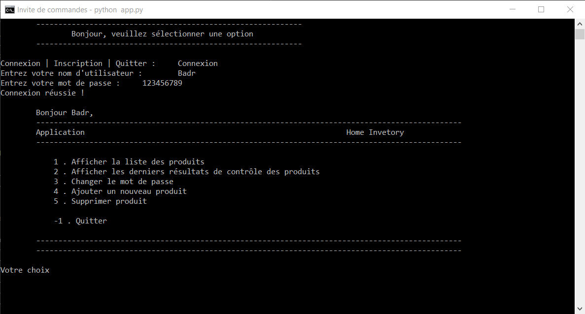
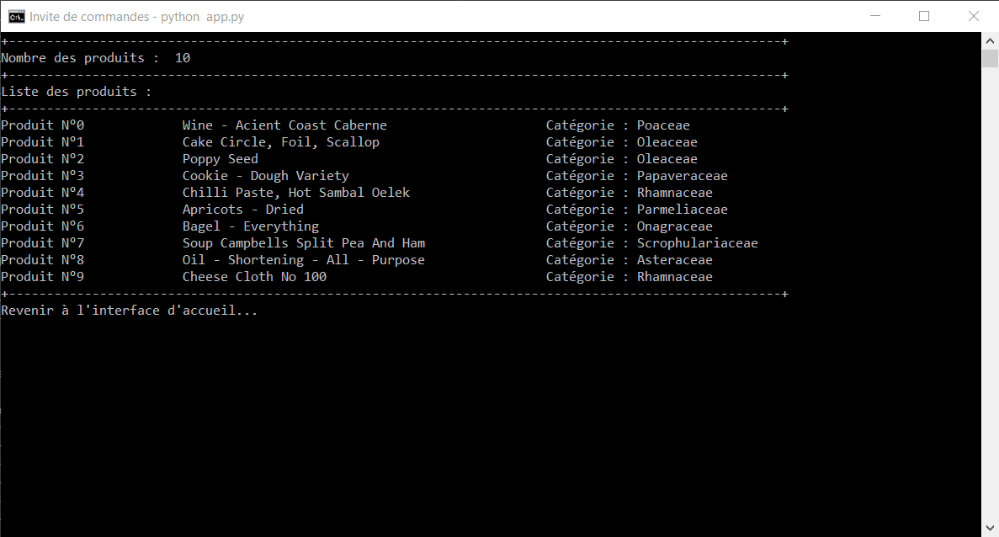
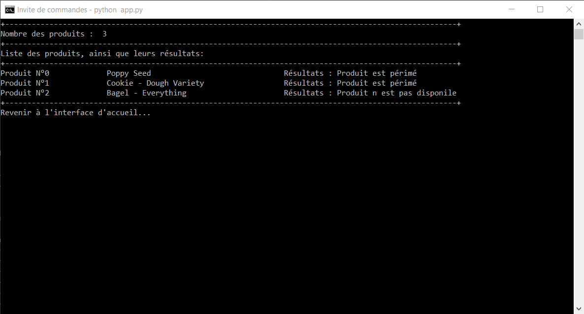

## Projet de base de données : Home Inventory 🏠👨‍💻
Conception et réalisation d’une application de gestion des stocks  

## ✨Présentation
Il s'agit d'une application réalisée en Python permettant de gérer des stocks.

## ✨Fonctionnalités

## ✨Pour commencer

### Pré-requis
- [Python](https://www.python.org/) 🐍 - Version : 3.9.5
- [mysql-connector-python]() - Version : 8.0.28

### Installation de l'application
1. Installer le projet à partir de la branche master du dépôt `projet-base-de-données` Github : `git clone <url>`.

1. Installer Python via le [site](https://www.python.org/downloads/).

1. Créer un environnement virtuel à l'aide de VirtualEnv. Dans votre terminal, taper la commande : `pip install virtualenv` pour installer VirtualEnv puis `virtualenv -p python env`.

1. Activer l'environnement virtuel via `source env/bin/activate`. Pour quitter l'environnement taper simplement `deactivate`.

1. Dans le terminal, se placer au niveau du fichier `requirements.txt`, puis installer les différents packages nécéssaires avec la commande suivante : `pip install -r requirements.txt`.

1. Lancer l'application avec la commande `python ./app.py`.

## ✨Structure

## ✨Le projet en quelques images
Les images suivantes présentent les éléments principaux du projet. Tous les détails sont disponibles dans le [rapport]().

## ✨Auteurs
[Badr-Eddine Marani](mailto:badr-eddine.marani@centrale-casablanca.ma)

[Aymen Lakhyar](mailto:aymen.lakhyar@centrale-casablanca.ma)
